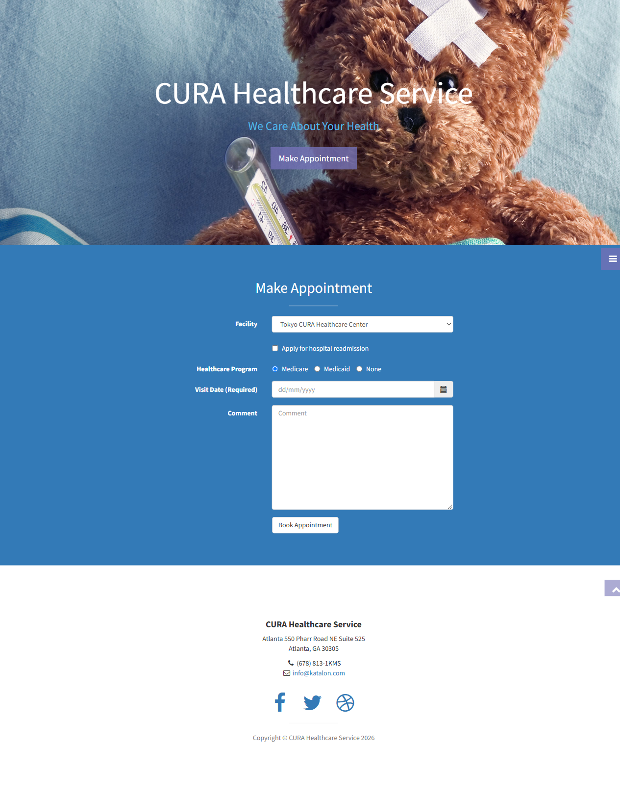
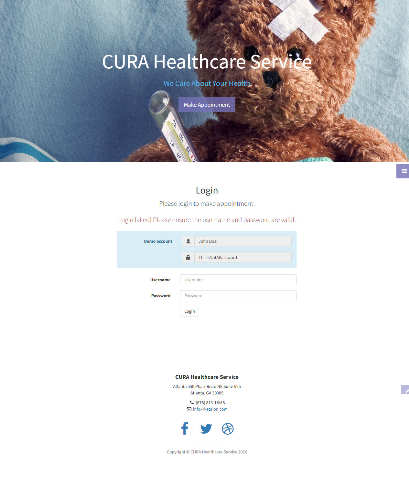
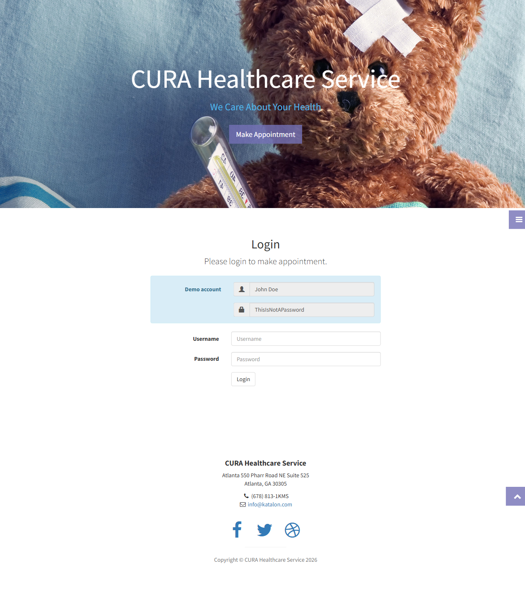
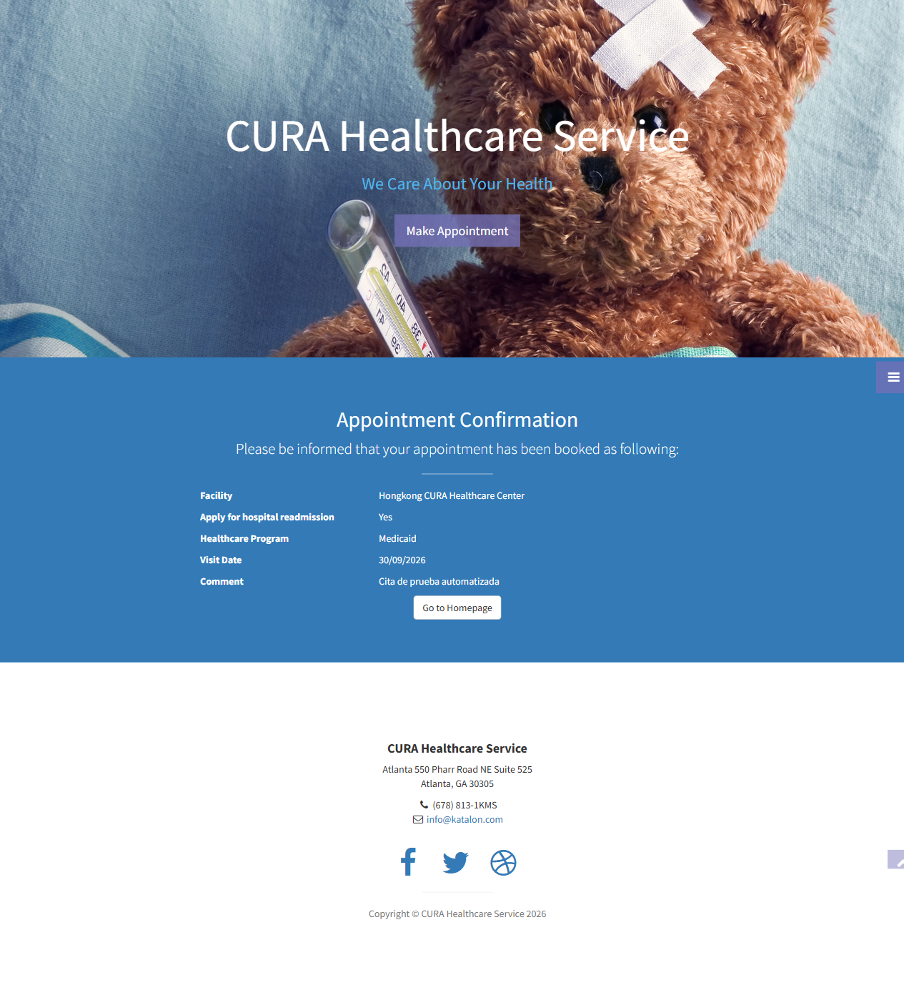

# Pruebas automatizadas con Playwright

Proyecto de automatización end-to-end para **CURA Healthcare Service**, realizado con Playwright y TypeScript.

## Aplicación probada

- URL: https://katalon-demo-cura.herokuapp.com/
- Navegador: Google Chrome instalado localmente
- Usuario válido: `John Doe`
- Contraseña válida: `ThisIsNotAPassword`

## Requisitos

- Node.js y npm
- Google Chrome instalado en:
  `C:\Program Files\Google\Chrome\Application\chrome.exe`

Las dependencias del proyecto ya están declaradas en `package.json`.

## Instalación

```powershell
npm install
```

No es necesario descargar Chromium de Playwright. La configuración usa el Chrome instalado en el equipo.

## Ejecución

Ejecutar todas las pruebas:

```powershell
npm test
```

Ejecutar con el navegador visible:

```powershell
npm run test:headed
```

Abrir el reporte HTML:

```powershell
npm run test:report
```

Ejecutar únicamente el archivo principal:

```powershell
npx playwright test tests/login.spec.ts
```

## Casos de prueba

Los cuatro casos están dentro de un único archivo: `tests/login.spec.ts`.

| Caso | Descripción |
| --- | --- |
| 01 | Login correcto con credenciales válidas. |
| 02 | Login incorrecto parametrizado con `for...of` y tres combinaciones inválidas. |
| 03 | Validación de los campos y botón del formulario de login. |
| 04 | Creación de una cita con centro, readmisión, programa, fecha y comentario. |

## Evidencias

Las capturas se generan automáticamente al ejecutar las pruebas y se guardan en `evidencias/`.

### Test 01: Login correcto



### Test 02: Login incorrecto



### Test 03: Formulario de login



### Test 04: Cita creada



## Estructura del proyecto

```text
Guillermo_Gomez_048_P2/
|-- evidencias/
|   |-- test-01-login-correcto.png
|   |-- test-02-login-incorrecto.png
|   |-- test-03-formulario-login.png
|   `-- test-04-cita-creada.png
|-- tests/
|   `-- login.spec.ts
|-- playwright.config.ts
|-- package.json
|-- package-lock.json
|-- tsconfig.json
|-- .gitignore
`-- README.md
```

## Configuración principal

`playwright.config.ts` define:

- La URL base de CURA.
- Chrome local como ejecutable.
- Ejecución visible (`headless: false`).
- Capturas automáticas cuando una prueba falla.
- Reporte de consola y reporte HTML.

## Resultado de validación

La suite fue ejecutada correctamente:

```text
4 passed
```

## GitHub

Repositorio remoto:

https://github.com/GuillermoGome2z/048-P2-Guillermo-Gomez

Para publicar cambios posteriores:

```powershell
git add .
git commit -m "Actualizar pruebas y documentación"
git push
```